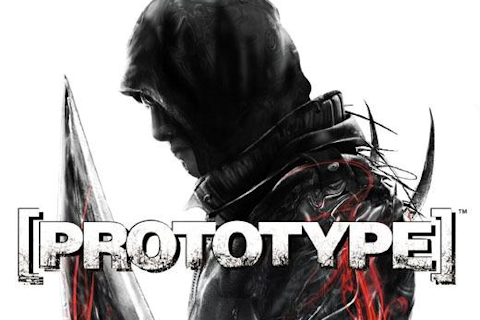

# Fixing Prototype Game Loading Crash Issue

### Methods (fix's way)
- <a href="#method-1-create-a-custom-launcher-script">Metod 1</a>
- <a href="#method-2-set-cpu-affinity-manually-via-task-manager">Metod 2</a>


|||
|:-------:|:------:|
|  |  |

---

When launching the Prototype game, some users experience a problem where the game gets stuck at the loading screen and then abruptly closes. Below are two methods to fix this issue.

---

## `Method 1`: Create a Custom Launcher Script

**Step 1:**  
Navigate to your Prototype game installation folder.

**Step 2:**  
Create a new text file named `Launcher.txt` in the game directory.

**Step 3:**  
Open `Launcher.txt` and paste the following code:

```batch
@echo off
cd /d "%~dp0"
start /affinity F prototypef.exe
```

**Explanation:**

- `@echo off`: Hides command lines for cleaner output.
- `cd /d "%~dp0"`: Changes the directory to the location of the script (Prototype folder).
- `start /affinity F prototypef.exe`: Launches the game with specific CPU affinity to stabilize performance and prevent the loading crash.

**Step 4:**  
Rename the file extension from `.txt` to `.bat` so it becomes `launcher.bat`.

**Step 5:**  
Run the game using `launcher.bat` instead of the original game launcher.

---

####  Steam support ⬇️⬇⬇️
## `Method 2`: Set CPU Affinity Manually via Task Manager

If the first method doesn't work, you can manually adjust CPU affinity settings for Steam through Task Manager.

### Steps:

1. **Open Task Manager** (`Ctrl + Shift + Esc`).
2. Go to the **Processes** tab and find **Steam**.
3. Right-click on **Steam** and select **Go to details**.
4. Locate `steam.exe` in the Details tab.
5. Right-click `steam.exe` and choose **Set affinity**.
6. In the CPU list, **check all CPUs from CPU 0 to CPU 8**.
7. Press **OK** to apply the settings.
8. Launch the Prototype game.

### Visual Guide:


---

## Disclaimer

> **Note:** Modifying CPU settings or using custom scripts may affect system performance. Proceed at your own risk.

---

## Summary

| Method | Description |
|-------|-------------|
| **Method 1** | Create a `.bat` file to launch the game with specific CPU affinity. |
| **Method 2** | Manually set CPU affinity for Steam via Task Manager. |

---